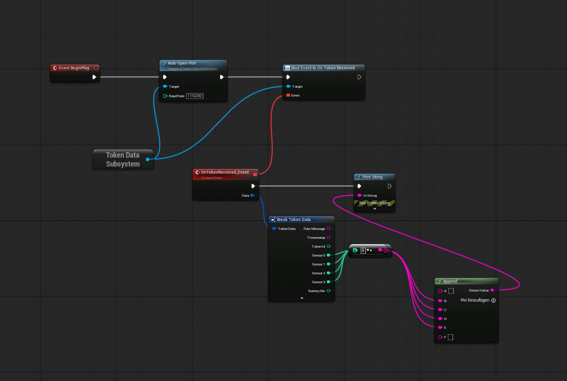

# TokenReceiver — UE5 Plugin

Reads token messages from an **ESP32-C6 Zigbee receiver** over USB serial and fires a Blueprint event for every message received. Works with the companion [sender firmware](https://github.com/Finn-Bluemel/ZigbeeTokenReceiver) running on Seeed XIAO ESP32-C6 boards.

---

## How it works

```
[Token ESP32 sender] --Zigbee--> [Receiver ESP32 USB] --Serial--> [TokenReceiver Plugin] --Blueprint Event--> your game
```

- The receiver ESP32-C6 is plugged in via USB
- The plugin auto-detects it by USB Vendor ID (`0x303A` — Espressif)
- A background thread reads serial data and parses token messages
- Each message is dispatched on the game thread via `OnTokenReceived`

---

## Message format

```
2026/04/28 11:33:39 [436135512] [0 1 0 2] batt:3603mV
                     ^token id   ^sensors  ^battery
```

Parsed into `FTokenData`:

| Field | Type | Description |
|---|---|---|
| `RawMessage` | FString | Full raw line |
| `Timestamp` | FString | Date/time string |
| `TokenId` | int32 | Unique chip ID of the sender |
| `Sensor0–3` | int32 | Touch sensor readings (0 or 1) |
| `BatteryMv` | int32 | Battery voltage in millivolts |

---

## Blueprint setup



1. **Get Game Instance Subsystem** → select `Token Data Subsystem`
2. Call **Auto Open Port** on `BeginPlay` (auto-detects the USB device)
3. **Bind Event to On Token Received** → create a custom event
4. Drag the `Data` pin → **Break FTokenData** → use the fields

---

## C++ usage

```cpp
UTokenDataSubsystem* Sub = GetGameInstance()->GetSubsystem<UTokenDataSubsystem>();
Sub->AutoOpenPort();  // or Sub->OpenPort("COM15", 115200);

Sub->OnTokenReceived.AddDynamic(this, &AMyActor::HandleToken);

void AMyActor::HandleToken(const FTokenData& Data)
{
    UE_LOG(LogTemp, Log, TEXT("Token %d | S:%d%d%d%d | %dmV"),
        Data.TokenId,
        Data.Sensor0, Data.Sensor1, Data.Sensor2, Data.Sensor3,
        Data.BatteryMv);
}
```

---

## Requirements

- Unreal Engine 5.5 or newer
- Windows (auto-detect uses SetupAPI; other platforms compile but serial is no-op)
- Receiver ESP32-C6 running the companion firmware, plugged in via USB

## Installation

1. Copy the `TokenReceiver` folder into your project's `Plugins/` directory
2. Reopen the project — UE will prompt to rebuild the plugin
3. Enable the plugin in **Edit → Plugins → TokenReceiver**
